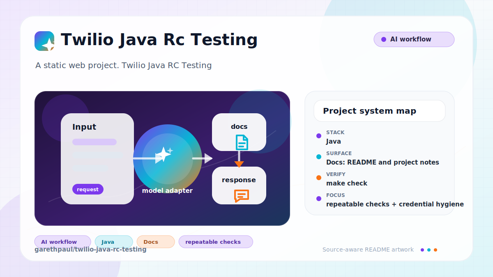

# twilio-java-rc-testing

<!-- README-OVERVIEW-IMAGE -->


## Overview

`garethpaul/twilio-java-rc-testing` is a Java HTTP sample for safe dry-run or explicitly enabled live Twilio voice calls.

This README is based on the checked-in source, manifests, scripts, and repository metadata on the `main` branch. The project language mix found during review was: Java (1).

## Repository Contents

- `README.md` - project overview and local usage notes
- `.github/workflows/check.yml` - hosted Java 8, 11, 17, and 21 verification
- `pom.xml`
- `Procfile`
- `scripts/check-baseline.sh` - repository maintenance baseline guard
- `SECURITY.md` - security reporting and disclosure guidance
- `src` - source or example code
- `VISION.md` - project direction and maintenance guardrails

Additional scan context:

- Source directories: src
- Dependency and build manifests: Procfile, pom.xml
- Entry points or build surfaces: none detected
- Test-looking files: src/main/resources/public/test.html

## Getting Started

### Prerequisites

- Git

### Setup

```bash
git clone https://github.com/garethpaul/twilio-java-rc-testing.git
cd twilio-java-rc-testing
```

The setup commands above are derived from repository files. Legacy mobile, Python, or JavaScript samples may require older SDKs or package versions than a modern workstation uses by default.

## Running or Using the Project

- Configure `TWILIO_PHONE_NUMBER` and `NGROK_URL` for dry-run testing.
  Configure `TWILIO_ACCOUNT_SID`, `TWILIO_AUTH_TOKEN`, and
  `TWILIO_SEND_LIVE=true` only when intentionally placing live calls. Live
  dialing also requires a strong `TWILIO_DIAL_TOKEN`; enter that value in the
  form for each authorized live request.
- Maven resolves the stable Twilio Java 12.1.1 SDK. HTTP routes use Java's
  built-in server, so the sample does not depend on vulnerable Spark/Jetty 9.4.
- Dependency management keeps Twilio's Java-8-compatible Jackson line at
  2.18.8 and Apache HttpCore at 5.3.6 to include hosted-scanner fixes.
- Run `mvn package` and then `java -jar target/Testing1234-1.0-jar-with-dependencies.jar`.
- The server uses `PORT` when it is a valid positive port number and otherwise
  falls back to `4567` for local runs.
- Open `/` and submit a valid E.164 phone number. The form posts to
  `/dial-phone`; the app rejects missing or malformed numbers before a dry run
  or live Twilio call, response messages redact dial targets, and invalid
  dial-target errors refer to the form submission rather than URL input. The
  checked-in form marks the phone number field as required before submission.
- Twilio SDK failures return a generic `502` response without exposing provider
  diagnostics, credentials, or request metadata.
- `NGROK_URL` must be a valid HTTPS origin URL with a host, without path,
  query, fragment, or userinfo, before the app builds a TwiML callback URL.
- The `/twiml` route returns TwiML XML with an explicit `application/xml`
  content type.
- Every HTTP response disables caching and framing, suppresses referrers and
  unused browser capabilities, and applies a restrictive Content Security
  Policy that permits only the existing Bootstrap stylesheet origin.
- Runtime logging defaults to `info`; switch to debug only in a local working
  copy when you are prepared to redact call metadata before sharing logs.

## Testing and Verification

- `make check`
- `scripts/check-baseline.sh`
- `mvn test`
- GitHub Actions runs `make check` on Java 8, 11, 17, and 21 with read-only
  repository permissions, non-persisted checkout credentials, Ubuntu 24.04,
  and immutable action pins. The baseline rejects additional workflow files.
- `mvn -DskipTests package`
- The baseline script checks required project files, completed docs-plan
  metadata, and local editor metadata hygiene.
- Tests keep the checked-in Log4j default at `info` rather than `debug`.
- Tests cover TwiML XML generation and the `/twiml` content type contract.
- Tests cover HTTPS origin callback URL validation before live-call setup.
- Tests cover safe `PORT` parsing before the built-in HTTP server starts.
- Tests cover dial-target redaction in response messages.
- Tests require a constant-time authorization-token match before live dialing.
  Live requests check that token before returning detailed Twilio credential,
  sender, or callback-origin configuration errors; dry runs remain
  unauthenticated and credential-free.
- Tests require provider failures to return a generic `502` without leaking
  exception details.
- Tests require oversized dial forms to return `413` before parsing or dialing.
- Tests require `/dial-phone` to accept the exact form media type, including
  case-insensitive parameterized variants, while rejecting missing, unrelated,
  and spoofed-prefix content types with `415`.
- Tests keep the live-call-capable `/dial-phone` endpoint and form submission
  on POST rather than GET.
- Tests keep invalid dial-target errors and required phone input aligned with
  the POST form flow.
- Tests keep local IntelliJ `.idea/` metadata ignored and out of the portable
  sample.
- Tests keep legacy Spark, Jetty, Velocity, and WebJars declarations out of the
  Maven build.
- Completed maintenance plans live under `docs/plans` and are checked by
  `make check`.

When the required SDK or runtime is unavailable, use static checks and source review first, then verify on a machine that has the matching platform toolchain.

## Configuration and Secrets

- Detected references to Twilio. Keep API keys, OAuth credentials, tokens, and account-specific values in local configuration only.

## Security and Privacy Notes

- Review changes touching authentication or token handling; examples from the scan include src/main/resources/public/index.html.
- Review changes touching external API calls or credential-adjacent configuration; examples from the scan include pom.xml, src/main/java/org/example/Main.java.
- Review changes touching network requests, sockets, or service endpoints; examples from the scan include pom.xml, src/main/java/org/example/Main.java, src/main/resources/public/index.html.
- Review changes touching file, media, JSON, XML, CSV, OCR, or data parsing; examples from the scan include pom.xml, src/main/resources/public/index.html.

## Maintenance Notes

- See `SECURITY.md` for vulnerability reporting and safe research guidance.
- See `VISION.md` for project direction and contribution guardrails.
- See `docs/plans/2026-06-08-twilio-java-rc-testing-baseline.md` for the
  canonical dry-run dialing and verification baseline.
- See `docs/plans/2026-06-08-twiml-content-type.md` for the TwiML XML response
  contract.
- See `docs/plans/2026-06-09-callback-url-validation.md` for HTTPS callback
  URL validation coverage.
- See `docs/plans/2026-06-09-port-parsing.md` for safe assigned-port parsing
  coverage.
- See `docs/plans/2026-06-09-callback-origin-validation.md` for callback
  origin validation coverage.
- See `docs/plans/2026-06-09-dial-target-redaction.md` for dial response
  redaction coverage.
- See `docs/plans/2026-06-09-post-dial-route.md` for POST-only dial route
  coverage.
- See `docs/plans/2026-06-09-post-invalid-dial-target.md` for POST-aligned
  invalid dial-target error coverage.
- See `docs/plans/2026-06-09-ide-metadata-ignore.md` for local IDE metadata
  ignore coverage.
- See `docs/plans/2026-06-09-scripted-baseline-check.md` for the scripted
  repository baseline guard.
- See `docs/plans/2026-06-09-unused-legacy-dependencies.md` for unused Maven
  dependency cleanup coverage.
- See `docs/plans/2026-06-10-dependencies-and-ci.md` for stable dependency and
  hosted Java matrix verification.
- See `docs/plans/2026-06-13-live-dial-authorization-order.md` for the
  authentication-first live request boundary.

## Contributing

Keep changes small and tied to the project that is already present in this repository. For code changes, document the toolchain used, avoid committing generated dependency directories or local configuration, and update this README when setup or verification steps change.
